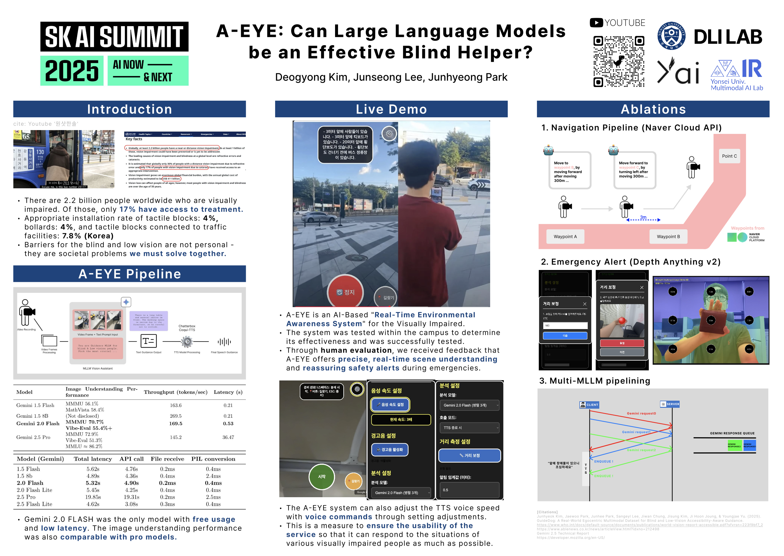
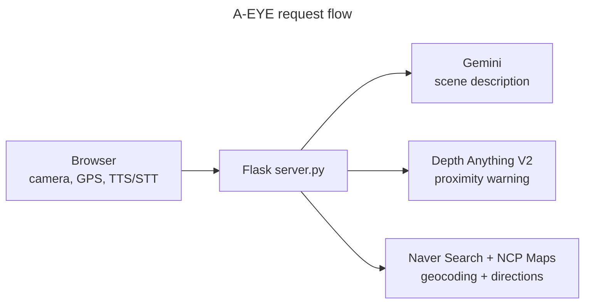

# A-EYE: Can Large Language Models be an Effective Blind Helper?

<div align="center">



**Deogyong Kim · Junhyeong Park · Jun Seong Lee**

Grand Award (IITP Director's Award) — 2025 SW-Centric University Digital Competition  
1st Prize — SK AI Summit *AI's Got Talent* (Nov. 2025)

<p>
<strong aria-current="page">English</strong> ·
<a href="README.ko.md" hreflang="ko" lang="ko">한국어</a> ·
<a href="README.zh.md" hreflang="zh" lang="zh">中文</a> ·
<a href="README.ja.md" hreflang="ja" lang="ja">日本語</a> ·
<a href="README.es.md" hreflang="es" lang="es">Español</a> ·
<a href="README.fr.md" hreflang="fr" lang="fr">Français</a> ·
<a href="README.de.md" hreflang="de" lang="de">Deutsch</a>
</p>

</div>

---

> **Note** — This README is written with screen-reader and low-vision readers in mind: H1 first, descriptive alt text on the hero image, a prose summary alongside the architecture diagram, `aria-current` and `hreflang` on the language switcher, and endpoints grouped under H3 landmarks for fast heading navigation. The previous standard formatting is preserved at [README.en.md](README.en.md). See the [Accessibility](#accessibility) section at the end for the full rationale.

## Overview

A real-time visual assistance web service for visually impaired users, exploring whether large language models can serve as an effective blind helper. The phone's camera streams scenes to a Flask backend that combines Google Gemini (vision-language reasoning), Depth Anything V2 (metric depth for proximity warning), and Naver Cloud Maps (turn-by-turn directions) to deliver concise spoken guidance about what is ahead.

## What it does

- **Scene narration.** Captures frames from the camera, sends them to Gemini with a prompt tuned for pedestrian safety (hazards, signage, transit info), and reads the answer back via the browser's TTS.
- **Pipelined inference.** Up to three Gemini API keys are rotated in parallel so a fresh description is usually waiting by the time the previous TTS finishes.
- **Proximity alerts.** Depth Anything V2 (metric, ViT-S/Hypersim) runs on the same frames; if anything within roughly 50 cm is detected, a warning beep plays. A one-time calibration step turns the user's height into a per-device scale factor.
- **Turn-by-turn navigation.** Given a destination phrase, the server resolves it to coordinates via Naver Search plus Naver Cloud Maps geocoding, fetches a walking route, and advances through waypoints as the browser's GPS reports new positions.

## Architecture

The browser captures camera frames, GPS, and voice. `server.py` dispatches each frame in parallel to three services: Google Gemini for the scene description, Depth Anything V2 for proximity warnings, and Naver Search plus Naver Cloud Maps for navigation.



| Layer | File / Module |
| --- | --- |
| HTTP and orchestration | `server.py` |
| Depth model | `depth_anything_v2/` (DINOv2 backbone with DPT head) |
| Frontend UI | `templates/index.html`, `static/script.js`, `static/style.css` |
| Warning beep | `static/1.wav` |
| Model checkpoint | `checkpoints/depth_anything_v2_metric_hypersim_vits.pth` |

## Prerequisites

- Python 3.10 (conda recommended)
- A CUDA-capable GPU is recommended. Calibration (`/calibrate`) is gated to GPU-only; depth inference will fall back to CPU but is slow.
- API keys:
  - **Google Gemini** — at least one key (`API_KEY_1`); add `API_KEY_2` and `API_KEY_3` to enable parallel rotation.
  - **Naver Cloud Maps** — Static Map, Geocoding, Reverse Geocoding, Directions 5/15.
  - **Naver Search** — used to convert place names to addresses before geocoding.

## Setup

```bash
cp .env.template .env
# fill in API_KEY_1..3, NAVER_CLIENT_ID/SECRET, NCP_CLIENT_ID/SECRET

conda create -n aeye python=3.10
conda activate aeye
pip install -r requirements.txt
```

## Depth model checkpoint

Place the Depth Anything V2 metric depth weights under `checkpoints/`. The default is the small Hypersim (indoor) variant:

```bash
mkdir -p checkpoints
wget -O checkpoints/depth_anything_v2_metric_hypersim_vits.pth \
  https://huggingface.co/depth-anything/Depth-Anything-V2-Metric-Hypersim-Small/resolve/main/depth_anything_v2_metric_hypersim_vits.pth?download=true
```

Other sizes (Base / Large) and the outdoor VKITTI variants are available from the [Depth Anything V2 collection](https://huggingface.co/depth-anything). Switching variants currently requires editing `MODEL_CONFIGS` and the checkpoint filename in `server.py`.

## Run

```bash
python server.py            # listens on 0.0.0.0:8081
python server.py --debug    # enables Flask debug mode
```

Open `http://<host>:8081` from a phone browser (camera and microphone permissions required).

### Keyboard shortcuts (desktop)

- `Space` — start or stop scene auto-analysis
- `Esc` — stop navigation (when active) or close the settings panel

## Endpoints

### Core analysis

| Method | Path | Purpose |
| --- | --- | --- |
| GET  | `/`           | Web UI |
| GET  | `/get_models` | List available Gemini models |
| POST | `/describe`   | Submit a frame and get a description (auto-starts pipelining) |

### Pipelining worker

| Method | Path | Purpose |
| --- | --- | --- |
| POST | `/upload_image`           | Register the latest frame for the pipelining worker |
| POST | `/start_auto_processing`  | Start the background pipelining worker |
| POST | `/stop_auto_processing`   | Stop and clear the worker, queue, and latest response |
| GET  | `/get_response`           | Pop the latest pipelined description |

### TTS coordination

| Method | Path | Purpose |
| --- | --- | --- |
| POST | `/set_tts_status`   | Tell the server whether TTS is currently speaking |
| GET  | `/get_tts_status`   | Read TTS status |
| GET  | `/get_queue_status` | Diagnostic readout of pipeline, API, and TTS state |

### Depth and calibration

| Method | Path | Purpose |
| --- | --- | --- |
| POST | `/calibrate`     | One-shot calibration from height and center-frame depth |
| POST | `/analyze_depth` | Detect objects within roughly 50 cm using the calibration factor |

### Navigation

| Method | Path | Purpose |
| --- | --- | --- |
| POST | `/start_navigation`        | Resolve goal, fetch route, create a navigation session |
| POST | `/update_location`         | Advance through waypoints based on current GPS |
| POST | `/navigation_describe`     | Describe a frame in the context of the active route |
| GET  | `/get_current_instruction` | Read the current waypoint instruction |
| POST | `/end_navigation`          | Mark a navigation session inactive |
| GET  | `/directions`              | One-shot directions lookup (no session) |

### Logs

| Method | Path | Purpose |
| --- | --- | --- |
| GET | `/logs`       | Tail `server.log` |
| GET | `/logs/clear` | Clear `server.log` |

## How calibration works

The user enters their height in cm. The server estimates arm length as roughly 26 percent of the user's height converted to metres — for example, 175 cm gives about 0.45 m. It then reads the depth at the centre of a frame held at arm's length, and stores arm length divided by measured depth as a per-user scale factor. Subsequent depth maps are multiplied by that factor before the 0.5 m proximity threshold is applied.

## Notes

- The pipelining design optimises for *time-to-spoken-result*: a new request can return a previously-queued description instantly while the next one is already in flight on a different API key.
- Gemini responses are dropped if TTS is currently speaking or if a stop signal has fired, so the user is never read a stale frame's description.
- Only the V1 (key-id and key) Naver Cloud Maps Directions endpoint is wired up. Migration to the API-Gateway v2 auth scheme is a future change.

## Accessibility

This README is written with screen-reader users in mind: the H1 precedes the visual hero, the architecture diagram has a prose summary alongside the Mermaid graph, the language switcher uses `aria-current` and `hreflang`/`lang` so each language link is announced and pronounced correctly, and the endpoint reference is split into smaller tables under H3 landmarks for fast heading navigation.
